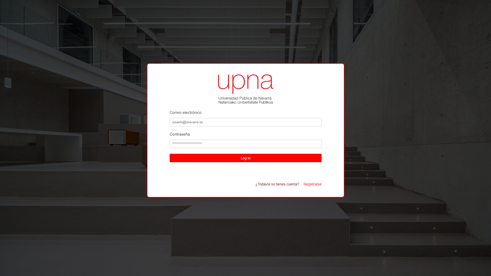
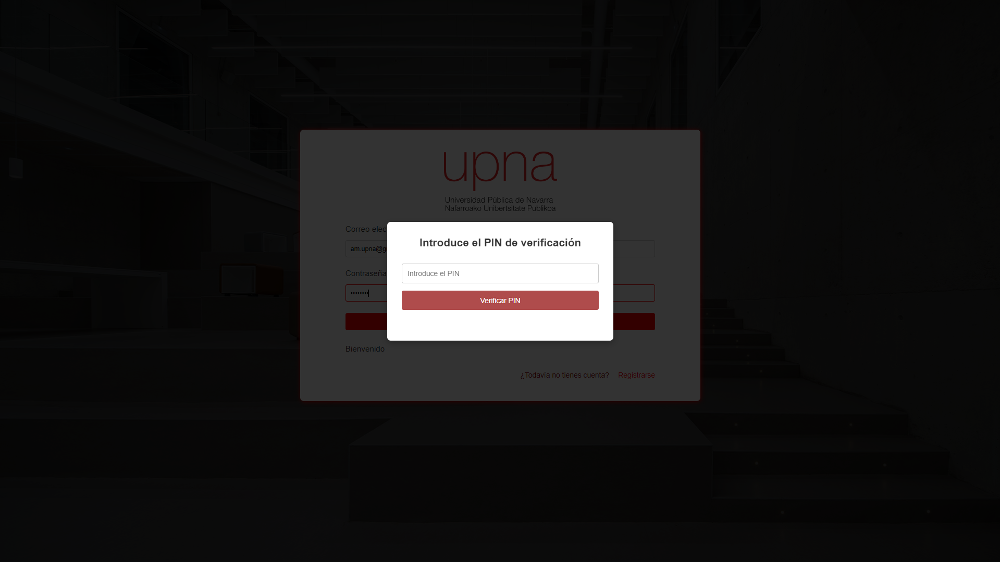
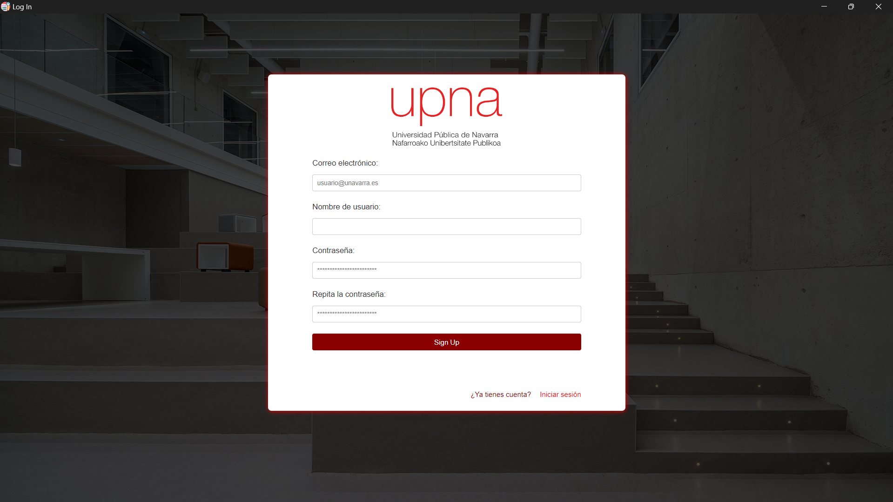
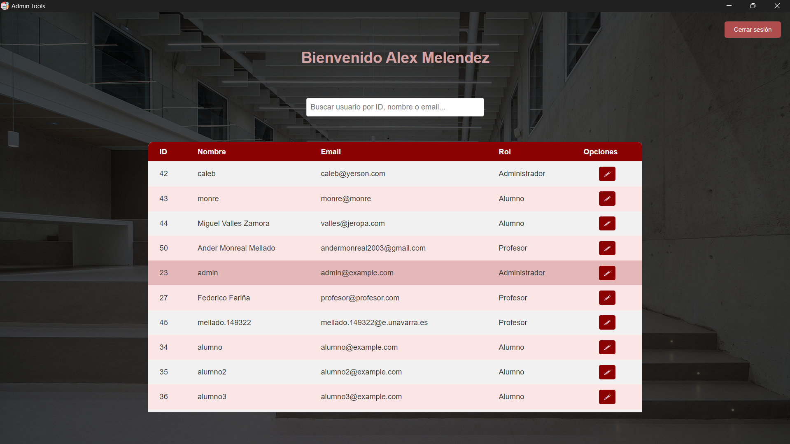
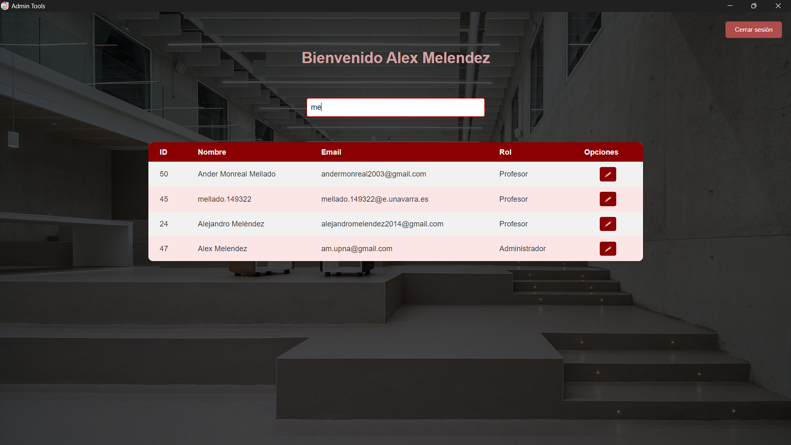
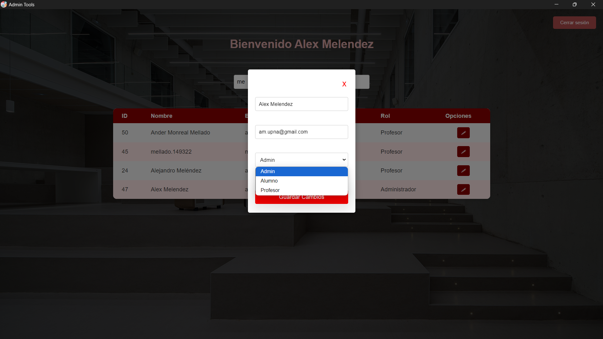
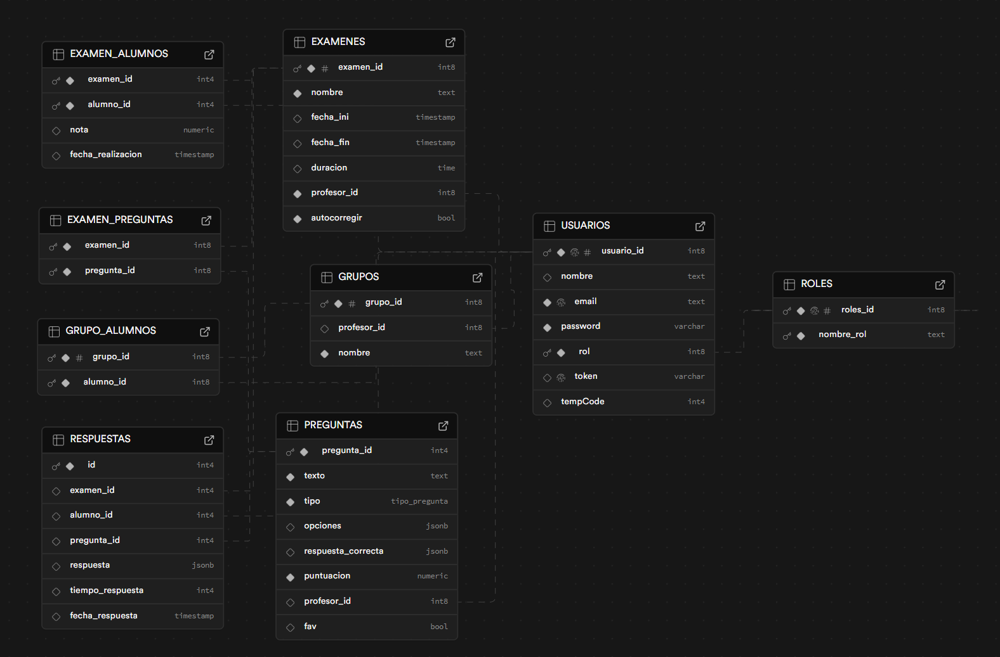

<h1>UPNA TESTER</h1> 
<h3>Proyecto de 4º de carrera de Ingeniería Informnática de la UPNA para la asignatura de "Gestión de Proyectos Informáticos I"</h3>  
  <table>
    <tr>
    <td>
        
      </td>
      <td>
        
      </td>
      <td>
        
      </td>
    </tr>      
  </table>

 
 
 
   <h1 margin=200px>MIEMBROS DEL EQUIPO</h1>
 
   <table>
    <tr>
      <td style="text-align: center;">
        
         
        <a href="https://github.com/amlndz">@amlndz</a>
        
Alejandro Meléndez

      </td>
      <td style="text-align: center;">
        
         
        <a href="https://github.com/andermonreal">@andermonreal </a>
        
Ander Monreal

      </td>
      <td style="text-align: center;">
        
         
        <a href="https://github.com/mellado149322">@mellado149322</a>
        
Iñaki Mellado

      </td>
      <td style="text-align: center;">
        
         
        <a href="https://github.com/WADEBER">@WADEBER</a>
        
Diego Liébana

      </td>
    </tr>
  </table>
   
 

## FORMAS DE EJECUTAR

#### EJECUTAR COMO APLICACION LANZANDO DESDE TERMINAL

Desde el directorio principal lanzamos tanto la API como la vista con el siguiente comando:

> npm start

#### CREAR Y LANZAR APLICACION DE ESCRITORIO (SOLO WINDOWS)

Desde el directorio principal debemos ejecutar el comando:

> npm run build

Este comando nos generaráa una carpeta "dist" a la cual deberemos acceder.
En esta carpeta veremos un .exe el cual si presionamos dos veces generara la versión de escritorio de este proyecto.

#### EJECUTAR API EN LOCAL

Se puede ejecutar unicamente la API desde una terminal por si queremos probar los checkpoints en postman. Para ello ejecutamos:

> node app.js

##### EJECUTAR PAGINA EN LOCAL

Recomendable installar en el VScode la extension de liveServer y ejecutar desde ahi

---

---

---

---

# VISUALIZACION RAPIDA DE LA WEB

> VENTANA LOGIN
>  

---

---

> VENTANA SING UP
> 

---

---

> PANEL ADMINISTRADOR
>   

---

---

---

# API

Lista de End Points:

---

---

### AUTH

> api/auth/login
> -----> +email, +password

> api/auth/singUp
> -----> +username, +email, +password

---

---

### ADMIN

> api/admin/listUsers
> -----> +token

> api/admin/checkAdmin
> -----> +token

> api/admin/getUser
> -----> +token, +identificador

> api/admin/modifyUser
> -----> +token, +usuario ({})

> api/admin/deleteUser
> -----> +token, +usuario_id

---

---

### PROFESOR

> api/professor/checkProfessor
> -----> +token

> api/professor/createExam
> -----> +token, +examen ({})

> api/professor/deleteExam
> -----> +token, +identificador

> api/professor/getListExams
> -----> +token

> api/professor/createQuestion
> -----> +token, +pregunta ({})

> api/professor/getListQuestions
> -----> +token

> api/professor/assignQuestToExam
> -----> +token, +pregunta_id, +examen_id

> api/professor/createNewGroup
> -----> +token, +nombre

> api/professor/addStudentsToGroup
> -----> +token, +grupo_id, +alumno_id ([{ "alumno_id" }])

## EJEMPLO DE BASE DE DATOS PARA PODER UTILIZAR ESTE CODIGO

> Base de Datos en SUPABASE
> 
